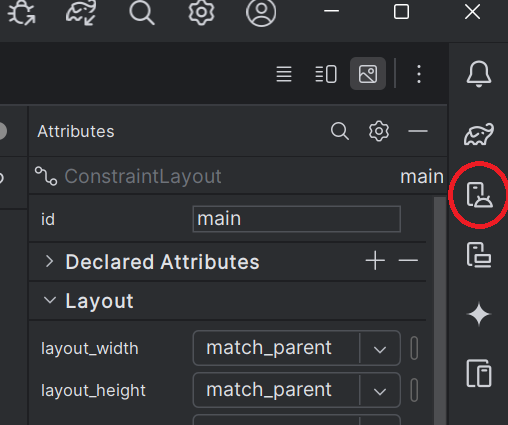

# Introduction to Android Studio

This lab will introduce the Android Studio IDE and Android project structure through the creation of a simple 'Hello World!' application that will run on emulated or physical devices.

#### Objectives

1. Familiarize IDE navigation
2. Introduce running apps on physical and emulated devices
3. Introduce layout editor
4. Project structure breakdown and highlights
5. Console log for debugging

#### Procedure

###### Create a new project

* Open Android Studio
* → Click on the _New Project_ button
* → Select __Empty Views Activity__ and click **Next**
* → For the project details add the following:
	* Name: Lab 1 Hello World
	* Package name: ca.unb.mobiledev.lab1
	* Language: Kotlin
	* Minimum API Level: API 27 ("Oreo; Android 8.1)
	* Change the _Build configuration language_ option to "Groovy DSL (build.gradle)"
* → Click **Finish**
	* Loading the application for the first time takes a while to run; please be patient

NOTES:

* The minimum API level specifies which version of the Software Development Kit (SDK) will be used to compile the app against
* Android Studio will use this information to provide accurate auto-complete information in addition to providing warnings when your code is not appropriately targeting the set minimum API level
* While you should target the most current version of the SDK setting a minimum SDK allows you to get backwards compatibility with devices running older versions
	* This allows for your application to run on a larger percentage of devices.

###### Start the Project

With the project created start it for the first time using the auto generated code.  We will make a few changes later on; the intention here is to ensure you can run the code.  Let's try this now using either a device and/or and emulator.  The options are listed below.

_Using a Device_

In order to connect to the device __Developer Mode__ needs to be enabled which allows for USB connection and debugging.

1. Navigate to your device Settings menu
2. Find About Device
3. Locate the Build number and click it 7 times
	* NOTE: The location of the build number and number of clicks may vary between devices; you may need to look up the device instructions
4. You will receive notice that developer mode has been unlocked
5. Navigate back one menu to System to access the new Developer options menu
6. Turn on USB debugging
7. With Android Studio open attach via USB cable an Android device to your computer
8. On your device press **OK** to allow USB debugging
9. Run the application by clicking Run → Run 'app'
	* Ensure your device is selected and click **OK**

_Using an Emulator_

Android Studio comes equipped with built-in device emulators and options for emulating real world devices for testing the applications you develop, to ensure functionality is as you expect it across a range of device types.

1. Select the Device Manager option from the icons on the right side of the editor view as shown below.

	* Alternately you can also select Tools -> Device Manager from the file menu.

2. Click on the __+__ button and select the __Create Virtual Device__ button
3. Create the type of virtual device you would like to use
	* You may also need to download the appropriate API runtime level
4. Ensure your emulated device is selected and click **OK**
5. Locate the Run menu along the File menu bar along the top of Android Studio and click Run ‘app’
	* You might need to click Stop first
	* You can also run the emulator by clicking the familiar green Play button along the icon toolbar

NOTE:
* These can be managed using the Android Virtual Machine (AVD) Manager at any time

_Using Android x86 Lab OS_

The lab computers do not have an Android Emulator installed by default.  They can be accessed through another virtual machine.

1. Launch Android Studio VM 
2. Launch Android OS VM
3. In the launch Android studio VM open a terminal
4. Enter the command 'adb connect 10.0.2.4:5555'
	* The terminal should respond with 'connected to 10.0.2.4:5555'
	* Android studio should now be able to find the emulated device. 

NOTE:
* This VM is slower than an Android Emulator but does allow us to simulate things like low battery state and receiving a text message, which this VM doesn't
* It does, however, let us run apps and test some basic functionality

**Deliverable 1**

Take a screenshot of your app running (on any device or emulator).

###### Layout Editor

1.Using the folder view along the far left side of Android Studio, navigate to and open the res/layout/_activity_main.xml_ file.
2. Click the ‘Hello world!’ text in the application window preview. The text field, which is an Android object called TextView that we’ll learn more about later, is highlighted.
	* Take note of the _Attributes_ window that populates to the right
	* This toolbar shows the Android View objects that can be customized.
3. Explore the options available, and customize this TextView
4. Change the font size, text colour, background colour, etc. Move the TextView around inside the app
5. Try selecting a different device for the layout editor; does the layout still look like you want it to?
	* Note that font sizes should always be specified in 'sp', a scale-independent pixel
	* This is a convenient way to size fonts in Android that will ensure it stays looking good on a variety of device screens
	* For other objects you will want 'px' or density-independent pixels 'dp'
	* For more information read the [Dimension descriptions in the Android API Guide](http://developer.android.com/guide/topics/resources/more-resources.html#Dimension)


###### Project Structure

We will now take a look at what every Android Studio project structure has in common to develop an understanding of how this folder structure is navigated and how each piece ties together.  The structure of the application is shown below.

```
→ app
	→ manifests
		→ AndroidManifest.xml
	→ kotlin+java
		→ mobiledev.unb.ca.lab1
			→ MainActivity
		→ mobiledev.unb.ca.lab1 (androidTest)
			→ ExampleInstrumentedTest
		→ mobiledev.unb.ca.lab1 (test)
			→ ExampleUnitTest
	→ res
		→ drawable
			→ ic_launcher_background.xml
			→ ic_launcher_foreground.xml
		→ layout
			→ activity_main.xml
		→ mipmap
			→ ic_launcher
			→ ic_launcher_round
		→ values
			→ colors.xml
			→ strings.xml
			→ themes
				→ themes.xml
				→ themes.xml (night)
		→ xml
			→ backup_rules.xml
			→ data_extraction_rules.xml

→ Gradle Scripts
```

More information about the project structure can be found at [ProjectFiles](https://developer.android.com/studio/projects/index.html#ProjectFiles)


#### manifests Directory

This directory contains the AndroidManifest.xml file. This file contains information that pertains to how your application should run, what activities within your project it depends on, and of those which is to run when the application is first launched, as well as any device/account access permissions users must agree to before being able to download your application if placed on the Google Play Store.

Additional information on the  AndroidManifest.xml can be found [here](https://developer.android.com/guide/topics/manifest/manifest-intro.html)

**Deliverable 2**

The application theme is also described in this AndroidManifest file; provide the attribute tag that describes this.

NOTE:
* The _*android:label*_ attribute tag contains the application name we gave to our project
* If you click this an @string resource named app_name will be revealed in as being the source of this text
	* We’ll explore the strings.xml resource below

#### kotlin+java Directory

This java folder contains a sub-directory for your application code ```mobiledev.unb.ca.lab1``` and sub-directories for testing. We'll focus on the non-test folder for now.  These test folders will be covered later in the semester.

As no additional content has been added to the project the only class file is the **MainActivity** file.  This is the first activity to run when the application is launched.  Looking at the code in the file will reveal some familiar syntax used in Java; recall that Kotlin has roots based off Java and uses the same runtime engine.
	* A class named MainActivity is declared and the file contains some imports and the package under which this file belongs is denoted
		* This class extends the base class ```AppCompatActivity```
		* Note the Kotlin syntax is ```class_name : base_class``` and does not use the ```extends``` keyword  
	* There is an ```onCreate()``` method which takes a ```Bundle``` parameter which is passed up to the superclass from which we are overriding
* Look through the [Activity documentation](http://developer.android.com/reference/android/app/Activity.html) to find the method ```setContentView()``` that is used inside the ```onCreate()``` method
	* Be sure to find the method which takes the proper parameter type; in this case a layout resource ID

**Deliverable 3**

Describe what the ```setContentView()``` method call accomplishes for your application.

#### res directory

This directory contains many different types of resources that get used inside an application.

* The drawable folder can contain custom image files that can be utilized in your application to add finely customized theming or object styles, icons or any other visual assets necessary for your application.

* The layout directory contains the  _activity_main.xml_ file along with other resource files.
	* The _activity_main.xml_ is the resource that is sent as a parameter to the ```setContentView()``` method call in our MainActivity.kt class file discussed above
		* Open this file to once again reveal the GUI layout editor
			* Near the top right corner there are three options: _Code_, _Split_, and _Design_
		* Switch from the Design tab to the Code tab
		* You’ll be presented with a hierarchy of XML tags each containing attributes relevant to defining the layout for the application you created in the GUI editor
		* Layouts can be designed in either fashion, by GUI or XML. The menu directory contains a similar file for customizing the layout for menu appearances in your application
		* More details can be found [here](http://developer.android.com/guide/topics/ui/declaring-layout.html)

**Deliverable 4**

1. What are the three common layout types?  
2. Why is it important to define IDs for view objects especially when using RelativeLayout?

* The mipmap directory contains icons used for launch deck icons for the application
	* Note how multiple files are supplied; this is to target devices with differing levels of pixel density screens.

* Under the values directory there first is a _colors.xml_ file
 	* Initially this file contains the base colors for your application
	* These are used to simply create a cohesive color scheme experience across the application by allowing the Android OS to allow existing Android View Object components to rely on these three initial colors for coloring common application components (```TaskBars```, etc.)

* Labels used throughout the application can be defined in the _strings.xml_ file
	* Open strings.xml and you’ll see an XML tags containing the application name
	* String can be referenced in multiple locations within an application and only require being altered in one location to propagate changes throughout the app
	* New strings can be defined here and then referenced using the ```@string/string_name``` syntax we saw earlier
	* You can change your application string name here and it will be reflected along your application ```Toolbar``` when the activity is run

* The _themes.xml_ is where application theming and specific Android object styling can be achieved
	* We will cover styles and theming in a future lab

#### Gradle Directory

Android uses Gradle for dependency management and build tasks.  By default two Gradle files are created.  
	* The ```build.gradle (Project: Lab_1_Hello_World)``` script is used to define where to find project specific dependencies and configuration options
	* The ```build.gradle (Module: app)``` script is used to establish build requirements to ensure the proper syntax are being met for your target SDK choice
		* The _compileSdk_ value specifies the API level being used to compile the project (not the same as runtime targets)
		* Notice there is a _minSdk_, _targetSdk_, and _versionCode_ value
			* The _minSdk_ indicates what the lowest SDK that is supported by your application
			* The _targetSdk_ is the optimized version you have in mind for your device
			* If the _versionCode_ value is changed users will have updates triggered on their device

### Locale Language Support

Now that we’re familiar with the _strings.xml_ resource file, let’s take a look at how to add locale-specific string support.  

1. Right click the app/src/main/res/values directory and select New → Values Resource File
	* Enter **strings** in the File Name field
	* From the Available Qualifiers select Locale and select the **>>** button
	* In the language filter search for Spanish; this will set the list of chosen qualifiers to **es** and directory name as **values-es**
	* Click **OK** to save
	* Repeat the same process for French (fr)

3. In the values-es/strings.xml file, add the following:
```xml
<resources>
    <string name="app_name">Mi Aplicación</string>
</resources>
```
4. In the values-fr/strings.xml file, add the following:

```xml
<resources>
    <string name="app_name">Mon Application</string>
</resources>
```

5. Run the application using either an emulator or device once again
	* Access the settings menu from inside the emulator and set the language to French
	* Locate your application icon in the application deck
	* Open your application and you will see your French strings have been selected based on your custom locale choice
	* Set the locale to es-Spanish and do the same

6. Notice that the string "Hello World!" does not change. This is due to the fact that this string is hard-coded in the code.
	* Add a new string called _hello_world_ for "Hello World!" in the English file
		* Remember to translate the string and update each of the language specific resource files
	* Modify activity_main.xml to use this new string

**Deliverable 5**

Take screenshots of your application with French and Spanish translations and save them. Then set the language of the emulator back to your preferred language.


### Console Log Debugging

Being able to identify what is occurring within your application at certain points in the running cycle is important for any development process. Android Studio offers the ability to have log messages printed to the console.

1. Open the _MainActivity.kt_ class file
2. Immediately after the onCreate function add the following code:

```kotlin
companion object {
    // String for LogCat documentation
    private const val TAG = "Main Activity"
}
```

3. Inside ```onCreate()``` add the following:

```kotlin
Log.i(TAG, "This is a log display!")
```

4. You will also need to add an ```import android.util.Log``` statement.

5. Run the application via the emulator or device once more
 	* Along the bottom portion of Android Studio, click the _Logcat_ tab
	* This section has been modified in recent versions to show the log levels by color and letter indicator
	* In the query field you should see the running project name (in this case package:ca.unb.mobiledev.lab1) 
	* Append the value _level:info_ to filter out some of the log messages
		* Info messages will show as green with the letter _I_
	* This tactic can be utilized throughout the development cycle to test certain portions of your code to know how an application is behaving and where in the application may be encountering problems

**Deliverable 6**

Take and save a screenshot of the log message window.

**Lab Completion**

* Submit a document with the following items:
	* The screenshots you took of the app
	* Your answers to questions asked throughout

* Keep a copy of your project work and answers for future reference
