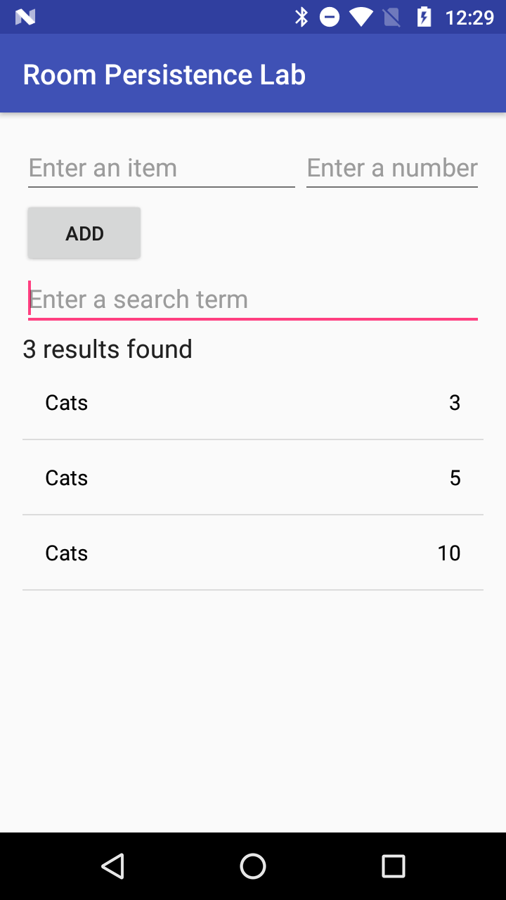

# Lab 6 - Room Persistence Library

In lecture we have explored different storage mechanisms available for app specific data.  One of the more used alternatives is to make use of a [SQLite database](https://www.sqlite.org/) which allows for more complex structured data to be stored.  

We also learned that there are several issues and shortcomings with using SQLite directly.  To help address some of these shortcomings the Room Persistence Library framework was introduced.  In this lab you will build a simple app that uses a SQLite database and Room for managing the data.

## Pair Programming

We will again be doing pair programming for this lab.  Details on pair programming can be found at [Pair Programming](../../docs/PAIR_PROGRAMMING.md).  You can again work with anybody of your choosing.

## App Functionality

Once completed the user will be able to use the app for the following:
* Add new rows to the database
* Search for rows that have a particular item
  * Below is a sample screenshot of the app after the user has searched for the item "Cats".

    

  * In this case the database had three rows with the item "Cats" with the numbers "3", "5", and "10".
    * Note that the results have been sorted by number.

  * In the case that a search item does not match any rows in the database, a message indicating this is displayed, as shown below.

    


## Resources

This lab makes use of java.util.concurrent.ExecutorService asynchronous execution mechanisms as opposed to AsyncTask which has seen in a previous lab.  In order to work with the ExecutorService tasks must be delegated for execution.  A few notes on the ones that will be of use for this lab.

* Execute Runnable - Takes a java.lang.Runnable object and performs the task.
  * NOTE: there is no way to obtain a result from this; the operation returns a void
  * Good for performing insert or delete operations
  * In order to get a result from the task a Callable will need to be used
  * For example:
  ```java
  AppDatabase.databaseWriterExecutor.execute { 
    println("Asynchronous task") 
  }
  ```
* Submit Callable - Uses a Callable instead of a Runnable
  * The result of the operation can be obtained by the Java Future object returned by the submit call
  * This is used for operations when you need to return specific records or a list of records that do not need to have the LiveData lifecycle
  * For example:
  ```java
  var future: Future<T> = AppDatabase.databaseWriterExecutor.submit(object : Callable<T?>() {
        @Throws(Exception::class)
        fun call(): T? {
            println("Asynchronous Callable")
            return "Callable Result"
        }
    })
  println("future.get() = " + future.get());
  ```

The following documentation will be helpful in this lab.

* [Android Room Persistence Library](https://developer.android.com/training/data-storage/room)
* [Accessing Data using Room](https://developer.android.com/training/data-storage/room/accessing-data)
* [ExecutorService](https://developer.android.com/reference/java/util/concurrent/ExecutorService)
* [View Model Overview](https://developer.android.com/topic/libraries/architecture/viewmodel)
* [Room Persistence Library example](https://github.com/hpowell-UNB/cs2063-fall-2024-examples/tree/main/data_storage/RoomPersistenceLibraryDemo) from class


**Task 1**

1. Download the skeleton project for the lab and review the existing code.

  * Start by having a look in the app/build.gradle file
    * There you will notice the following dependency imports which enable us to use the Room Persistence framework
    ```java
    // Room Components
    implementation "androidx.room:room-runtime:$roomVersion"
    annotationProcessor "androidx.room:room-compiler:$roomVersion"
    kapt "androidx.room:room-compiler:$roomVersion"
    ```
    ```java
    // Lifecycle components
    implementation "androidx.lifecycle:lifecycle-extensions:$archLifecycleExtensionsVersion"
    kapt "androidx.lifecycle:lifecycle-common-java8:$archLifecycleVersion"
    ```
    
  * You are provided the following classes for use:
    * `dao/ItemDao.kt`
      * Interface class which contains the methods for accessing the database
      * The @Dao annotation identifies it as a DAO class for Room
      * This class will need to be updated to include the appropriate queries
    * `db/AppDatabase.kt`
      * Database holder class; main access point to the data
        * This class must be defined as abstract and extend RoomDatabase
        * You annotate the class to be a Room database with @Database and use the annotation parameters to declare the entities that belong in the database and set the version number
          * Each entity corresponds to a table that will be created in the database
        * A Singleton object is being created to prevent multiple instances of the database being opened at the same time
        * To help with asynchronous access an `ExcecutorService` object is defined with a fixed thread pool that can be used to run database operations asynchronously on a background thread
    * `entity/Item.kt`
      * Class defined as an @Entity class which represents a SQLite table
    * `repository/ItemRepository.kt`
      * Class used to manages queries and enables the use of multiple backends
        * In our case it is used to provide a clean API for data access for the rest of the app
    * `ui/ItemViewModel.kt`
      * A `ViewModel` acts as a communication center between the Repository and the UI
      * In our app, this class is used as the bridge between the `MainActivity` class and the `ItemRepository` class
    * `ui/ItemsAdapter.kt`
      * This class translates the records and updates each row in the `ListView`
      * We have seen an example of an adapter when using the recycler view; similar idea here
    * `utils/KeyboardUtils.kt`
      * This class contains a utility function for hiding the virtual soft keyboard tobe used in the MainActivity class
    * `MainActivity.kt`
      * Entry point for the app
      * This class contains two inner AsyncTask classes which will be used to call the database methods and handle the results

**Task 2**

After having looked through the code, the next steps are to setup the database classes.

1. Update the `Item.kt` class to define the properties of the entity model
  * HINT: Each defined attribute in the class represents a column in the table
2. Update the `ItemDao.kt` class to include two methods
  * HINT: One for search and one for insert
3. Update the `ItemRepository.kt` to create the interface between the view model and the database

**Task 3**

With the database code in place you will now need to update the UI to work with the saved data.

1. Update the `ItemsAdapter.kt` class to set the name and number text values.
2. Update the `ItemViewModel.kt` class to create the methods used by the UI classes to work the data
3. Complete the TODO items in the `MainActivity.kt` class

**Writeup Task - For At Home Completions Only**

Create a document with the following items:
	* A screenshot of the running application
  * A screenshot of a new item added to the database
	* Screenshot showing the following scenarios:
    * No results
    * Single result
    * Mutliple results

**Lab Completion**

* IN LAB: 
  * Show the working app running on an emulator and the document with the screenshots to the instructor or TA
* AT HOME: 
  * Submit `MainActivity.kt`, `Item.kt`, `ItemDao.kt`, `ItemRepository.kt`, `ItemViewModel.kt`, and `ItemsAdapter.kt` along with the answers to the writeup task to the Lab6 drop box folder on D2L 

* Keep a copy of your project work and answers for future reference