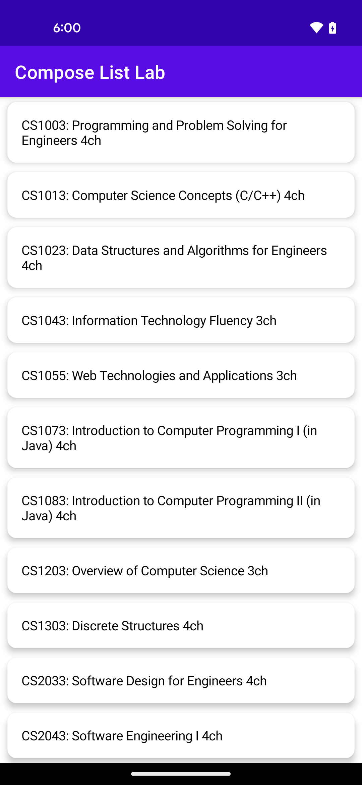

# Lab 8 (BONUS) - Scrolling Lists with Jetpack Compose

We have seen throughout the class different ways of building applications in terms of patterns and features.  We also heard about some of the newer style constructs and language features being introduced.  For the final lab we will be doing some experimentation with one of the alternate ways of building and styling native Android applications.  

## Pre-lab reading

For building the interfaces so far we have been working exclusively with XML files for defining UI layouts.  [Jetpack Compose](https://developer.android.com/compose) represents a paradigm shift in Android UI development by offering a fully declarative UI toolkit which allows developers to describe the UI in a concise and intuitive manner. To help you along the way have a look at the [Compose layout basics](https://developer.android.com/develop/ui/compose/layouts/basics) documentation.


## Introduction

In this lab we will look to replicate the scrolling list from Lab 5, however, instead of using a Recycler View we will be using Composable functions.

For the first steps we will look to replicate the list and detail view as they were shown at the end of Lab 5.  For example:


Selecting a row takes the user to the details screen.


### Project Structure

Upon loading the skeleton project for the lab please note the following classes have already been provided.

* `models/Course` represents a course
    * Data class where there is a getter method to retrieve the course title along with each of the separate fields.
    * Also includes in the class are test functions for using throughout for a sample course list and single course element.
    * Note the use of [Parcelable](https://developer.android.com/reference/android/os/Parcelable) which will allow you to pass the entire object as an Intent extra.

* `utils/JsonUtils` is a class used to work with ```JSON``` files
    * The app will make use of the contents included in an included asset file (```assets/CS.json```) which contains information about Computer Science courses available at UNB
    * ```JsonUtils``` processes the ```JSON``` to create ```Course``` items
    
* `Constants` object class containing the key names for the Intent extra values used between activities
  
* `DetailActivity` corresponds to the second screenshot above, displaying information about a specific course
    * It doesn't do much yet as you will be completing it during the lab

* `MainActivity` presents the scrolling list of courses
      
One last comment about UI layouts.  You will notice that there are no layout files.  Compose makes use of a folder called __ui.theme__.  The intention is to have developers use native Kotin for managing the UI elements as opposed to XML.  Also alongside the base files above are the following files:
* Color.kt
* Shape.kt
* Theme.kt
* Type.kt

## Previewing Changes

Similar to the different views available for XML files, you see a running preview of the app inside the IDE without the need to start an emulator.  You will notice at the bottom of both the MainActivity and DetailActivity is a function which are decorated with the following annotation.

```kotlin
@Preview(showBackground = true)
```

1. Try opening this view and building the project.  
    * There will not be much to show at this time, however, keep using this view throughout as you make changes to see updates in (mostly) real time.
 
## Required Lab Todos

For this lab you will need to learn independently and read lots of documentation.  For the first part let's recreate the scrolling list.

1. Complete the required TODOs in `MainActivity`.
2. Complete the required TODOs in `DetailActivity`.

Upon completion of the TODOs the application screens should appear like the screenshots above.

## Optional Lab Todos

With the base functionality in place we will see how efficiently we can make small changes to the elements to provide a more polished UI.  

1. Attempt to complete at least one (1) of the following optional changes.
    * Time permitting see how many you can complete.

**Optional Change 1**

MainActivity - Apply Card styling to each data row.



**Optional Change 2**

MainActivity - Include an image in each data row.


**Optional Change 3**

DetailActivity - Show additional course details.


NOTE:
* The above is a sample implementation.  Feel free to apply any styling you would like.

## Lab Completion

As this lab covers material we have not covered in class the expectation is you experiment with the new constructs and go as far as you can in the given time.  Nothing to submit; the primary goals are to gather feedback so this lab can be incorporated in future semesters and to have some fun trying something different.